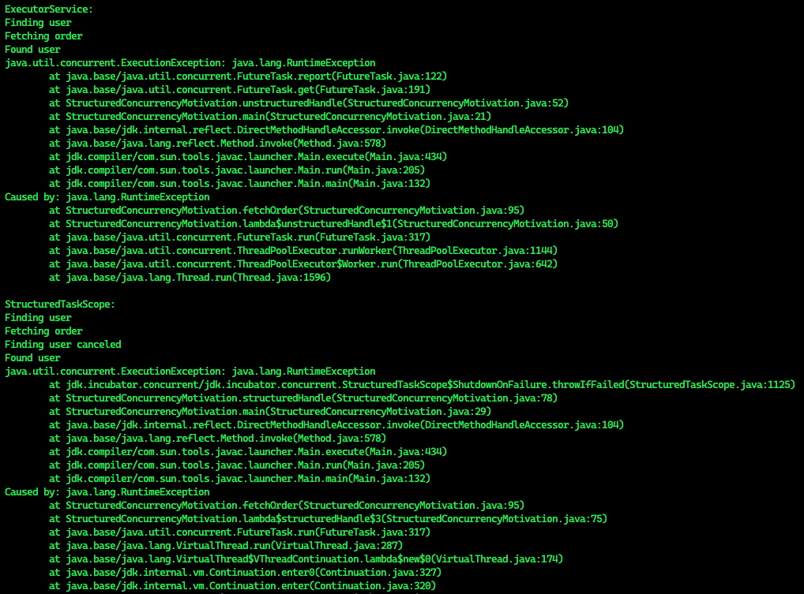
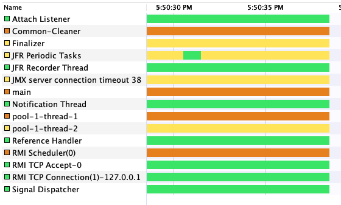
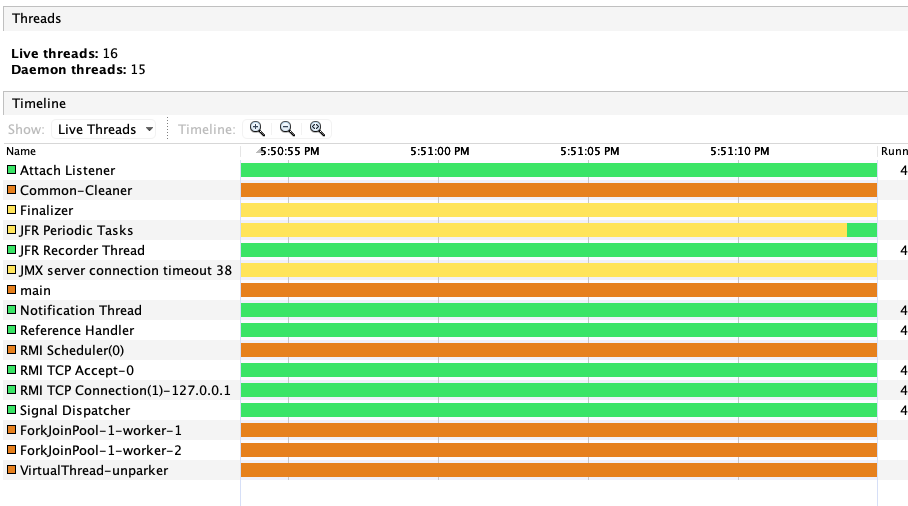

# Example of Structured Concurrency

The output that we can see that the `StructuredTaskScope` canceled other subtask (throwing a `InterruptedException`):


Deze code toont een voorbeeld van ongestructureerde concurrentie in Java met behulp van de `ExecutorServic`e en de nieuwe `StructuredTaskScope` van Java 19. Er wordt een voorbeeld gegeven van hoe een ExecutorService kan leiden tot problemen zoals thread leaks en onnodige wachttijden bij foutbehandeling, en hoe de StructuredTaskScope deze problemen kan oplossen door onder andere short-circuiting, propagatie van annulering en helderheid in de code. De code gebruikt de functies findUser() en fetchOrder() om te demonstreren hoe de twee methodes van foutbehandeling verschillen.
```shell
java --source 19 --enable-preview --add-modules jdk.incubator.concurrent StructuredConcurrencyMotivation.java
```



Thread view of concurrency using `ExecutorService`:



Thread view of concurency using `StructuredTaskScope`:



We can not the virtual thread running with ForkJoinPool.
