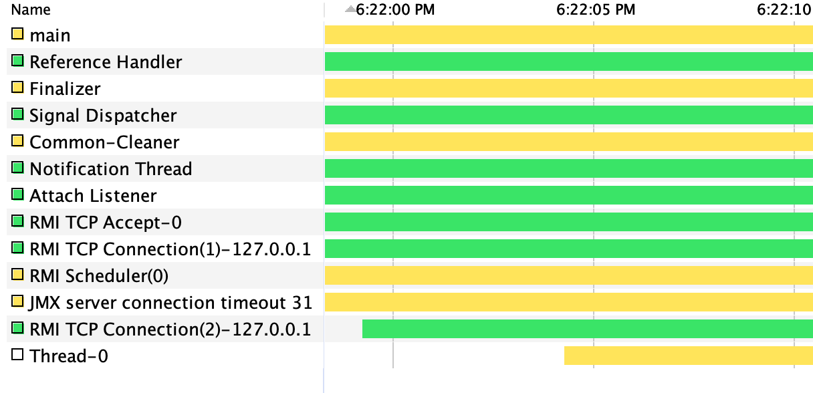
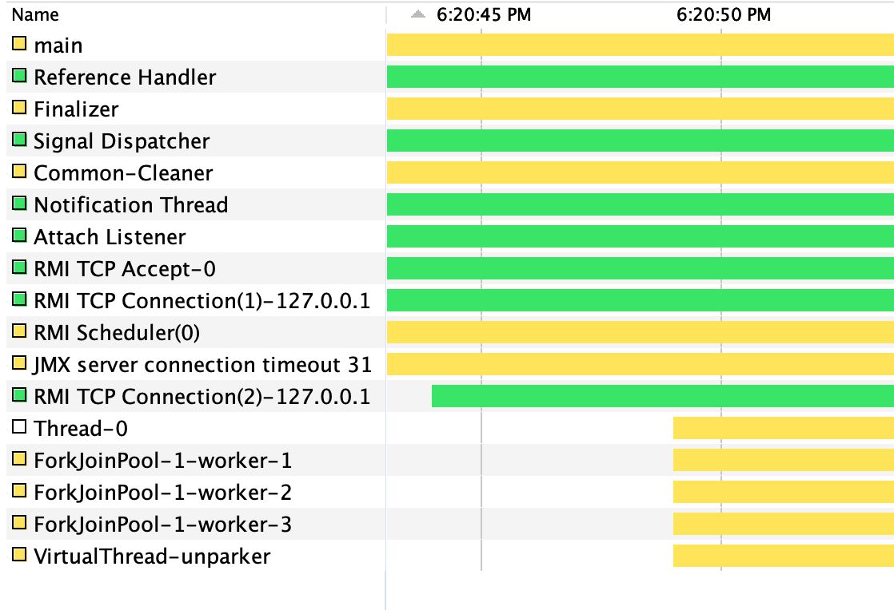

# Java Loom

This project tries to explore the features that Project Loom is bringing to Java.

We can see details about it at [project wiki](https://wiki.openjdk.java.net/display/loom/Main).

> Project Loom aims to drastically reduce the effort of writing, maintaining, and observing high-throughput concurrent applications that make the best use of available hardware.

> Project Loom intends to eliminate the frustrating tradeoff between efficiently running concurrent programs and efficiently writing, maintaining and observing them.

## Definitions

**Virtual Thread**

Virtual threads are just threads, but creating and blocking them is cheap:

- they are managed by the Java runtime;
- they are not one-to-one wrappers of OS threads;
- they are implemented in userspace in the JDK.

```shell
java --enable-preview --source 19 VirtualThreadCountThreads.java
```

About usual thread resources:

> A thread requires the ability to suspend and resume the execution of a computation.
> This requires preserving its state, which includes the instruction pointer, or program counter, that contains the index of the current instruction, as well as all of the local computation data, which is stored on the stack.

About virtual thread resources:

> Loom adds the ability to control execution, suspending and resuming it, by reifying its state not as an OS resource, but as a Java object known to the VM, and under the direct control of the Java runtime.

About the API:

> [...] we learned during that experiment — that we can keep parts of the Thread API and de-emphasize others — moved the needle in favor of keeping the existing API, and representing our user-mode threads with the Thread class. And here we are: virtual threads are just Threads, and any library that knows Thread already knows virtual threads.

About concurrent access:

> [...] how do we limit concurrent access to some service? Instead of breaking the task down and running the service-call subtask in a separate, constrained pool, we just let the entire task run start-to-finish, in its own thread, and use a semaphore in the service-call code to limit concurrency — this is how it should be done.

Compatibility:

> Everything built on top of the JDK will now work with virtual threads.

**Pinning**

There are still some ways to block the virtual thread, and the worker thread that is executing it, this is a state called pinning virtual thread.

> We say that a virtual thread is pinned to its carrier if it is mounted but is in a state in which it cannot be unmounted. If a virtual thread blocks while pinned, it blocks its carrier.

Can occur when:

- if virtual thread call native code (JNI)
- inside a `synchronized` block or method (is recommended to use `ReentrantLock`)

## Test

You can download a ealry access build from [here](https://jdk.java.net/loom/)

We can explore the limitations using VM option `-Djdk.defaultScheduler.parallelism=N`.

Creating a virtual thread:

```java
Thread t = Thread.startVirtualThread(() -> {
	System.out.println("Hello world from Virtual Thread!");
});
```

There is also a nice [builder](https://download.java.net/java/early_access/loom/docs/api/java.base/java/lang/Thread.Builder.html).

```java
Thread.ofVirtual()
	.name("Virtual-Thread-Name")
	.start(() -> {
		String name = Thread.currentThread().getName();
		System.out.printf("Hello World from Virtal Thread called %s!\n", name);
	});
```

**Java VisualVM**

Threads without use virtual threads:



By default, JVM is [currently] using ForkJoinPool as default scheduller for virtual Threads, that's why we can see 3 threads more than the previous print.



## References

- [Loom Proposal](https://cr.openjdk.java.net/~rpressler/loom/Loom-Proposal.html)
- [State of Loom](https://cr.openjdk.java.net/~rpressler/loom/loom/sol1_part1.html)
